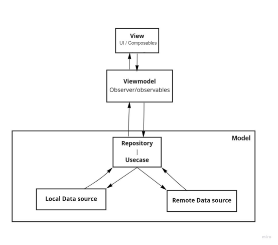

# Android-Architecture

------------------------ Architecture Details ------------------------

  MVVM clean architecture - Use case & Repository pattern
  MVVM is one of the architectural patterns which enhances separation of concerns, it allows separating the UI logic from the business logic
  MVVM has mainly the following layers:

  # View - View observes a ViewModel observable to get data in order to update UI elements.

  # ViewModel - ViewModel interacts with model and also prepares observable(s) that can be observed by a View. ViewModel can optionally provide hooks for the view to pass events to the model.

  # Model - Model represents the data and business logic of the app.

  

  Model- In model layer we used Repository and Use case patterns to get data from remote and local data source.

  Repository & Use case
  - It have repositories, a repository is an interface that has to be implemented in child classes where using use case objects operations are performed.
  - The purpose of the Use cases is to request data to repositories and turn into viewable data in use case we can perform operations to get data from remote as well as from local database.

  ------------------------ Features ------------------------ 
There are some wrapper classes whose services are used across whole app, like,

1) App Analytics:
   It is used to add events/actions from application to analytics server, using logEvents() method can add events, in arguments we can send any details that are to be logged with specific event.
   i.e appAnalyticsImpl.logEvents(
     AppAnalyticsImpl.Constants.EVENT_LOGIN,
         hashMapOf(
             EVENT_RESULT to  ACTION_LOGIN_SUCCESS
         )
     )
   In base class a appAnalytics class object is defined, we can use that object in any base class and can also inject the App analytics class object any where needed.

2) App Logger:
   It is used to add logs in application, we can use this object and can add any types of logs in application.
   This logger also stores the app log in firebase tables and in case of exceptional logs, device log file is also uploaded to firebase storage server.
   This added logs are sorted and saved to tables date and user wise, to search and use further.
   i.e.
     appLogger.printLog(getClassTag(), "Log event!)
     appLogger.printLog(getClassTag(), "I am Login screen!", AppLogger.LogType.V)
     appLogger.printLog(getClassTag(), "Login Fail "+error.description, AppLogger.LogType.E, Throwable(error.description))
   (Note: Only class name and message is required other are optional can pass if need to log for specific details)
   In base classes this appLogger instance is defined, we can use this object in any child class and can also inject this anywhere needed.

3) Exception Handling:
   To show user friendly/generic messages for handled exceptions, an app level AppExceptions class is used, using which in any exceptional cases we can pass the exception object and can get the user understandable message to show this to user.
   i.e.
    AppException.getErrorCode(throwable = FileNotFoundException())